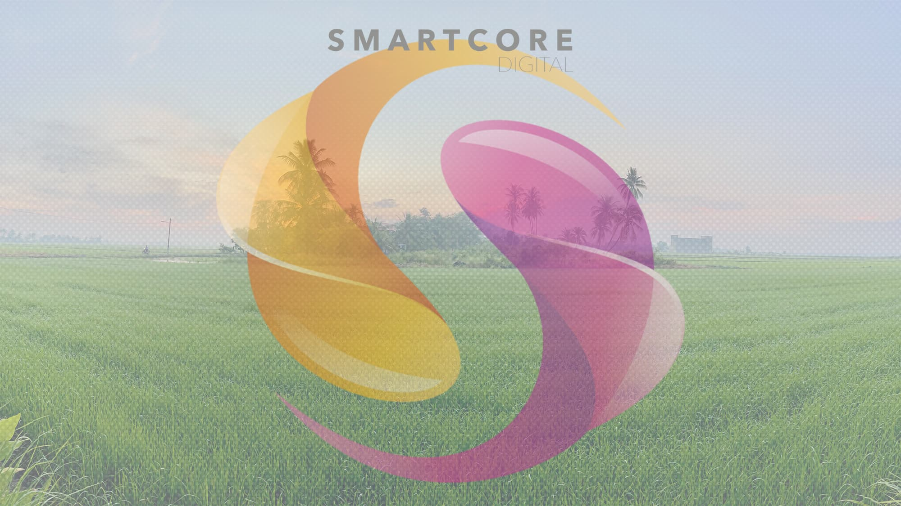

# Getting Started with Git at Github

---

# prerequisite 
* Open [Github](https://www.github.com)
* Sign-Up (required email)
* Create new Repository (define name and public or private)

---

# First Commit
* Add File -> Create new file -> README.md
* Add content: `# Git Introduction`
* Define Commit Message
* Commit
* Well done. your first Git commit

---

# Subsequent Commit
* Edit File README.md
* Modify the Content, Define Message and Commit
* Do it again or more.

---

# Navigate Around
* Get list of commit by `Click` on `commits` information
* Click on each commit `title` to see history and changes
* Browse the specific revision by clicking `<>`

--- 

# Pull Request
* Add File -> Create new file -> TODO.md -> add content:
```markdown
# Think we should do 
* Create File
* Create Branch
* Pull Request
* Merge
```
* add commit message and choose create new branch for pull request
* define branch `Todo` and Click `propose new file`
* `create pull request`
* We can comment, review, add more commit and finally merge the pull request.

---

# Pull Request Workflow
* Add new issue
* Create Milestone
* Add File `Workflow.md` as workflow pull-request branch
* Link pull-request with issue
* Code Review with comment, suggestion and Approval
* Integrate with CI with github workflow setup
* Squash and Merge to close the issue

---

# Advance Workflow
* Forking or initiate pull-request
* This require for non commit access repository
* Or for community contribution